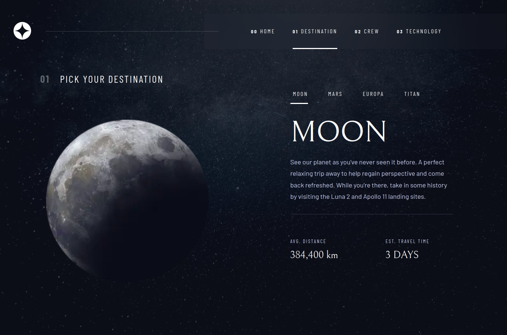
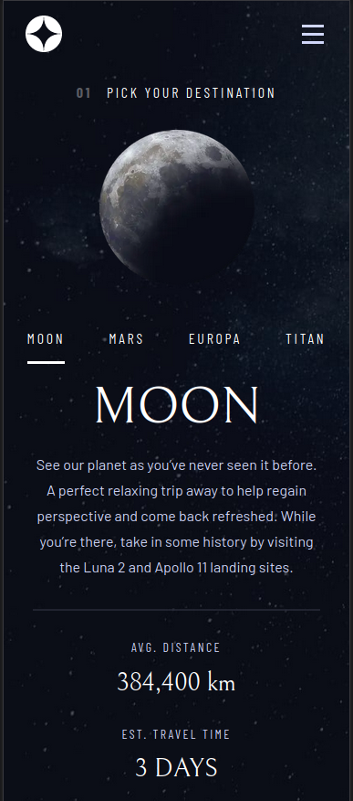

# Space Tourism Website

This is a solution to the [Space tourism website challenge on Frontend Mentor](https://www.frontendmentor.io/challenges/space-tourism-multipage-website-gRWj1URZ3). Frontend Mentor challenges help you improve your coding skills by building realistic projects.

NOTE: On Frontend Mentor it says this project is part of a Scrimba course. I didn't follow this course, I made it myself.

## Table of contents

- [The challenge](#the-challenge)
- [Screenshot](#screenshot)
- [Built with](#built-with)
- [What I Learnt](#what-i-learnt)
- [Author](#author)

## The challenge

Users should be able to:

- View the optimal layout for each of the website's pages depending on their device's screen size
- See hover states for all interactive elements on the page
- View each page and be able to toggle between the tabs to see new information

## Screenshot

## Built with

- [Next.js](https://nextjs.org/) - React framework
- CSS modules - comes with Next if you don't choose tailwindCSS

## What I Learnt

Using dynamic routes in Nextjs.

This challenge involved quite a bit of responsive design.

## Author

- Frontend Mentor - [@tomahawk-jupiter](https://www.frontendmentor.io/profile/tomahawk-jupiter)
